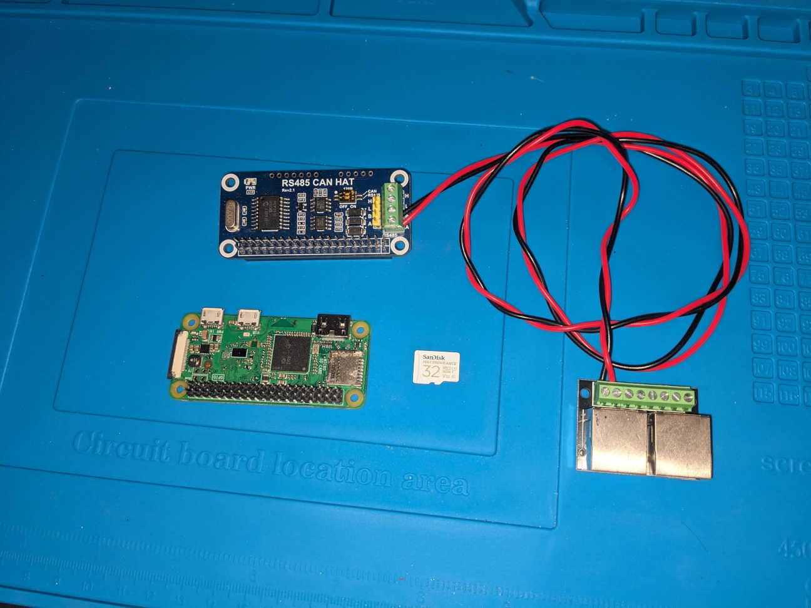

# Raspberry Pi Zero W - AirconPi Setup Guide

This guide describes preparing a Raspberry Pi Zero W to run the MyPlace server (airconpi) using an RS485/CAN HAT. It covers writing the OS image, basic host/user setup, enabling SSH + Wi‑Fi, installing OpenJDK 17, Maven and Git, pulling the code, building the project and installing a systemd service to start the service on boot.

**Prerequisites**
- A Raspberry Pi Zero W, microSD card (at least 8GB, prefer 16GB+), microSD card reader.
- A RS485 Adaptor or PI Hat
- A host computer (Windows/macOS/Linux) to write the OS image.
- Network access credentials (Wi‑Fi SSID and password).
- USB power for the Pi and any serial/RS485/CAN adapters as needed.

**Overview**
- Write Raspberry Pi OS
- Configure hostname and user/password
- Enable SSH and configure Wi‑Fi
- Boot the Pi, install OpenJDK 17, Maven, Git
- Clone MyPlace and build
- Configure systemd service to run the server at boot
- Notes on RS485 / CAN HAT configuration

## 1. Hardware Requirements


**Raspberry PI**
A PI Zero W or PI Zero 2 W has sufficient capability for this project:

https://core-electronics.com.au/raspberry-pi-zero-w-wireless.html

https://core-electronics.com.au/raspberry-pi-zero-2-w-wireless.html

**RS485**
A RS485 adaptor of some sort is required. I've used the following:

https://core-electronics.com.au/rs485-can-hat-for-raspberry-pi.html

An alternate may be the following. This could be powered using the power from the control board.
This appears to need drivers to use and I have not used one.

https://core-electronics.com.au/isolated-rs485-can-hat-b-for-raspberry-pi-2-ch-rs485-and-1-ch-can-multi-protections.html

A USB adaptor is also usable. I've been using the following:

https://www.amazon.com.au/DTECH-Converter-Adapter-Supports-Windows/dp/B076WVFXN8

**SD Card**
A high endurance SD card is recommended to reduce the chance of corruption.

**RJ45 Breakout Board**
Not required but makes the connections easier. Always test the pins match up to the correct screw terminal.
I went with the dual connector for easier traffic sniffing. Just make sure its not a crossover type.

https://www.amazon.com.au/Zicojia-Ethernet-Terminal-Breakout-Connector/dp/B0DK73V23D

A single connector would probably be better for a final product.

https://www.amazon.com.au/Hexchuang-Ethernet-Connector-Breakout-Interface/dp/B0G2XR57G8

---

## 2. Write the Raspberry Pi OS image (Raspberry Pi Imager)

1. Download and install Raspberry Pi Imager:
   - Windows/macOS/Linux: https://www.raspberrypi.com/software/

2. Follow Raspberry Pi Instructions:
   - https://www.raspberrypi.com/documentation/computers/getting-started.html
   - Recommended: "Raspberry Pi OS LITE" if using a Pi Zero W or Pi Zero 2 w
   - Set the hostname (airconpi will be used for these instructions)
   - Add a username (aircon will be used for these instructions)
   - Enable WIFI
   - Enable SSH

## 3. SSH & Wi‑Fi verification

- If you enabled ssh and wifi
- SSH in:

```bash
ssh aircon@airconpi.local
# or ssh aircon@<ip-address>
```

If mDNS (`.local`) doesn't resolve, use the IP address.

---

## 4. Enable Serial. RS485 / CAN HAT notes
*** Important: If using Serial ensure login shell is disabled over serial ***

Hardware setups vary by HAT/device. See specific documentation for device. 

- Ensure any device tree overlays required by the HAT are enabled in `/boot/config.txt` (check HAT docs).
- If your HAT uses UART, Enable serial and disable the login shell  via `raspi-config` → Interface Options → Serial). 
- If the HAT uses SPI/CAN, enable SPI (`raspi-config` → Interface Options → SPI).
- The RS485 transceiver usually exposes a `/dev/tty*` device (e.g. `/dev/ttyAMA0` or `/dev/ttyS0`). Confirm by running `dmesg` or `ls /dev/tty*` after attaching the HAT.

---

## 5. Install OpenJDK 17, Maven and Git

Update packages and install required software:

```bash
sudo apt update && sudo apt full-upgrade -y
# Install OpenJDK 17
sudo apt install -y openjdk-17-jdk-headless
# Verify java
java -version
# Install Maven and Git if building on PI.
sudo apt install -y maven git
# Verify
mvn -v
git --version
```

Note: Raspberry Pi OS package repos provide OpenJDK 17. OpenJDK 21+ are not currently packaged.

---

## 6. Pull the code from GitHub

Clone the repo under a suitable directory (e.g. `/home/aircon/projects`):

```bash
mkdir -p ~/projects
cd ~/projects
git clone https://github.com/iduno/MyPlace.git
cd MyPlace
```

---

## 7. Build the project

*** A PI Zero does not have enough memory to build. Requires building on another computer. ***

From the repository root run:

```bash
mvn clean install package
```

Notes:
- The build will produce artifacts in the `myplace/target` and `myplace/target/quarkus-app` directories depending on project packaging.
- Large builds may take significant time on a Pi. Consider building on a faster machine (x86) and copying the assembled `quarkus-app` folder or final jar to the Pi.

Optional faster workflow:
- Build on your PC and then `rsync` or `scp` the `quarkus-app`/jar to the Pi.


---

## 8. Create a systemd service to run the server

Create an install folder allow access for the executing user:

```bash
sudo mkdir -p /opt/airconpi
sudo chown aircon /opt/airconpi
sudo chgrp aircon /opt/airconpi
```

Copy the `myplace/target/quarkus-app` directory to `/opt/airconpi` and check the folder has the required files and folders:

```bash
ls /opt/airconpi/
# app  lib  quarkus quarkus-run.jar
```

create the folder `/opt/airconpi/config` and add `application.properties` file

```bash
mkdir -p /opt/airconpi/config
pico /opt/airconpi/config/application.properties
```

```ini
myplace.communication.serial.port=/dev/serial0
myplace.communication.serial.baud-rate=57600
myplace.communication.runmode=MYAIR
myplace.communication.type=SERIAL
myplace.communication.autoconnect=true
myplace.communication.http.server.port=2025
myplace.config.path=config/myplace.json

quarkus.http.host=0.0.0.0
quarkus.http.port=8080
```

Below is a generic example for a systemd config. Adjust `ExecStart` to the actual runnable produced by your build (jar, quarkus-app runner, or a shell wrapper). Place the service file at `/etc/systemd/system/airconpi.service`.

Example service (edit paths as required):
```bash
sudo pico /etc/systemd/system/airconpi.service
```
```ini
[Unit]
Description=AirconPi MyPlace service
After=network.target

[Service]
User=aircon
WorkingDirectory=/opt/airconpi
ExecStart=/usr/bin/java -jar /opt/airconpi/quarkus-run.jar
SuccessExitStatus=143
Restart=on-failure
RestartSec=5

[Install]
WantedBy=multi-user.target
```

Enable and start the service:

```bash
sudo systemctl daemon-reload
sudo systemctl enable airconpi.service
sudo systemctl start airconpi.service
sudo journalctl -u airconpi -f
```

Troubleshooting:
- If the service fails to start, inspect `sudo journalctl -u airconpi -b` and `sudo systemctl status airconpi`.
- Ensure the `ExecStart` path exists and Java runs correctly.

Placeholder: 

---


## 9. Security notes

- Standard service does not have authentication and anyone on the network can access the portal.

---
