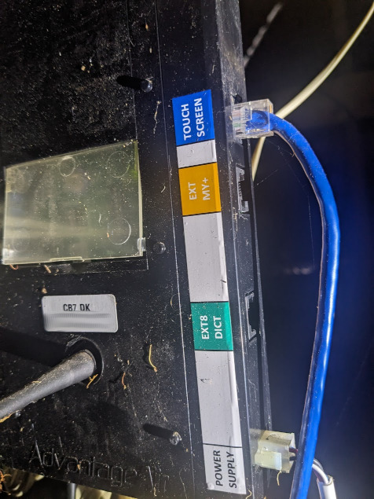
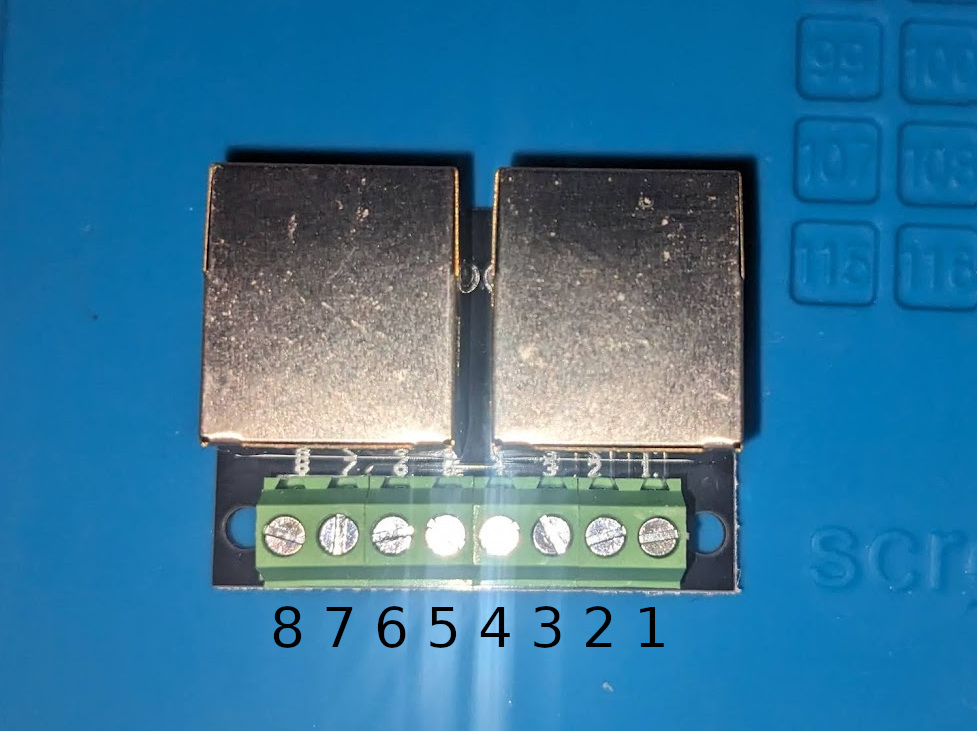
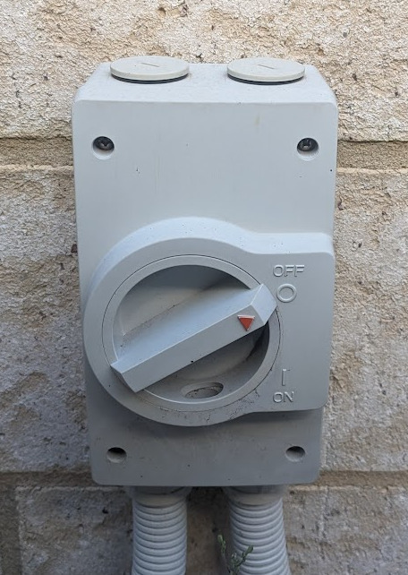
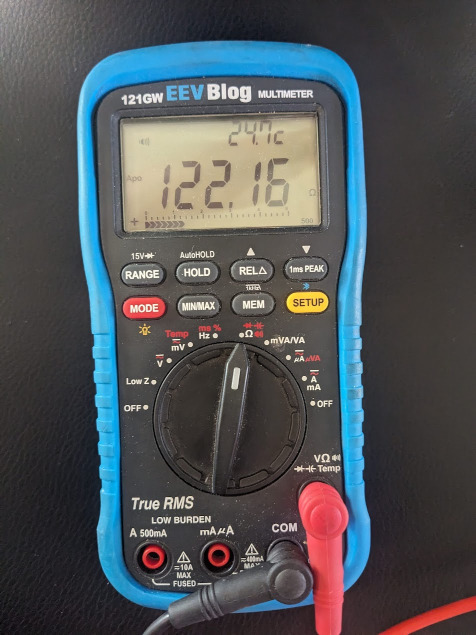
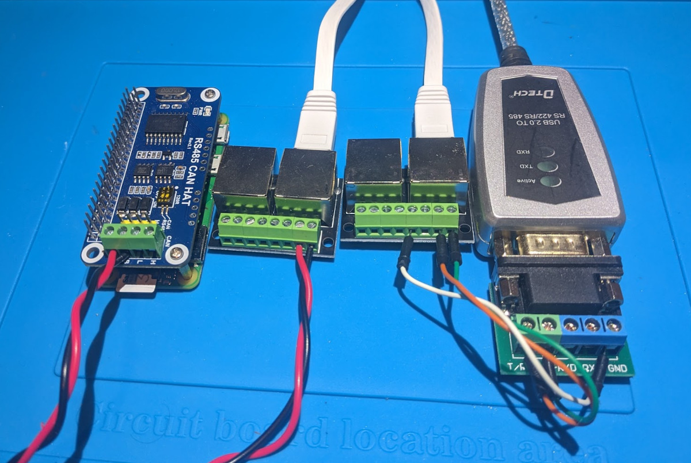

# Wiring diagram and connections

The control box communicates with RS485 and provides 14V power for the tablet.
The cable is a standard ethernet cable but the wiring is not compatible with an network port. 

*** Do not attempt to plug into the network port of a raspberry pi or any other network port. It may kill both the control board and the device its plugged into. ***

## Physical Connector

The RJ45 connection between the Control Box and the tablet has the following pinout:

| Pin | T568A colour | T568B colour |  Description |
| --- | ------------ | ------------ | ------------ |
| 1   | green/white | orange/white | RS485 Comms (B)- |
| 2   | green | orange | RS485 Comms (A)+ |
| 3   | orange/white | green/white | unused |
| 4   | blue | blue | GND |
| 5   | blue/white | blue/white | ~14V DC power to tablet |  
| 6   | orange | green | GND |
| 7   | brown/white | brown/white | unused |
| 8   | brown | brown | unused |
| Shield | | | GND |

Breakout boards may vary and should be tested to make sure the markings are correct. For the 2 port breakout used for testing, the pin numbering was as follows

## Connecting to RS485

Before attempting to connect to a RS485 adaptor, check that the correct wires are in use.

It is highly recommended to turn off the power to the air conditioner either at the meter box or via the cutoff switch.

To check that the RS485 wires are correct, check the resistance between pin 1 and 2 of the RJ45 cable using a multimeter in resistance mode. This will be around 120 ohms. If it is not around 120 ohms check other combinations to find the right pins.

Pin 4 and 6 should be checked using the continuity check function of the multimeter. These should be joined and will give indication that they are the ground pins.

Power can be checked with the aircon on between pins 4 and 5 and should read around 14 volts. Be carefull not to short anything with power on if running this test.

The RS485 hat or adaptor should also be checked that it has 120 ohms resistance. If not enable the 120 ohm switch or add a 120 ohm resistor between A and B on the adaptor end.

For wiring between the breakout board and the rs485 hat or adaptor, keep the A/B wires the same length and twisted.
Ground is not required, but if the adaptor or hat has ground, it can be connected.

